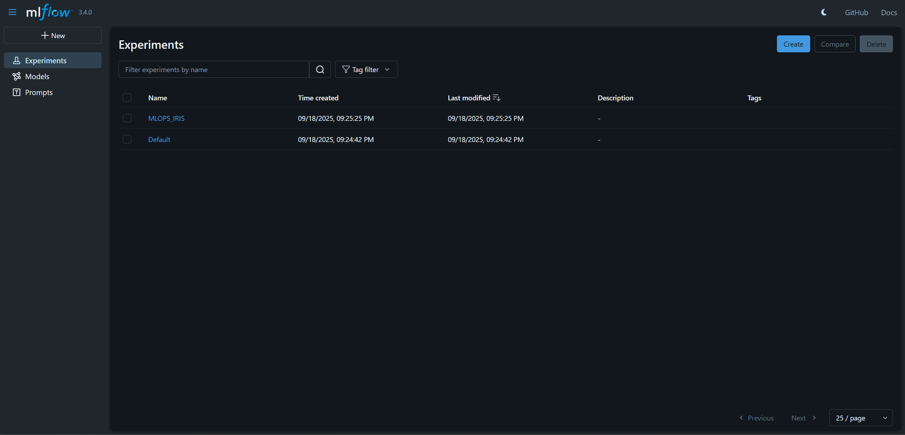
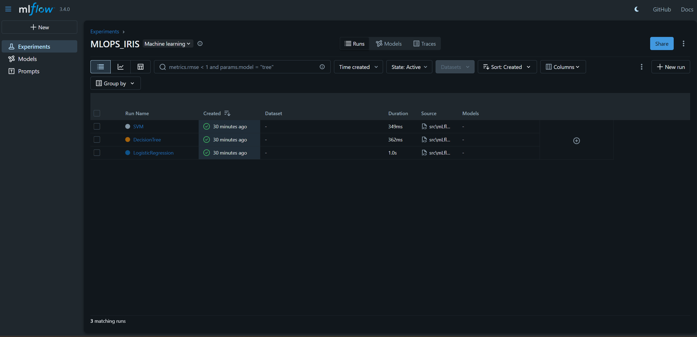
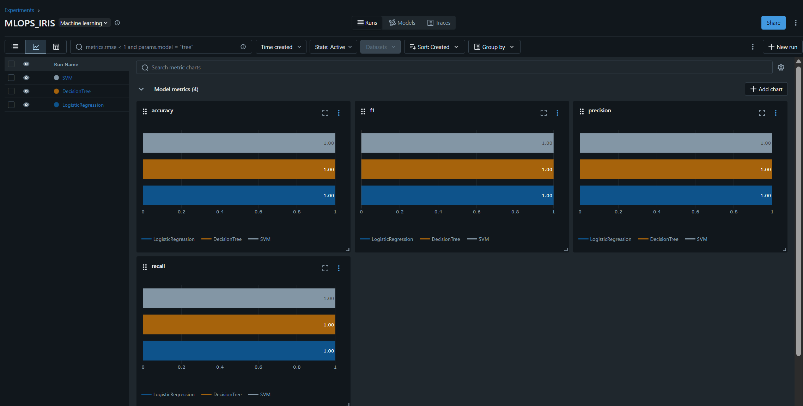
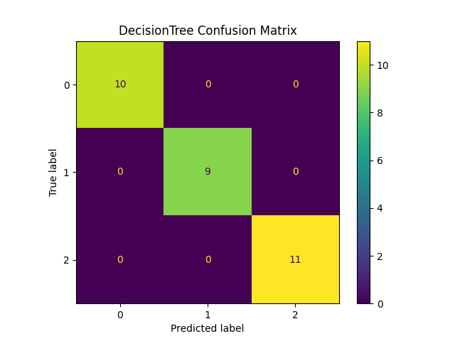
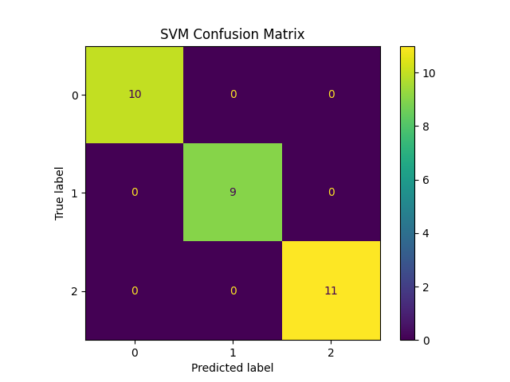
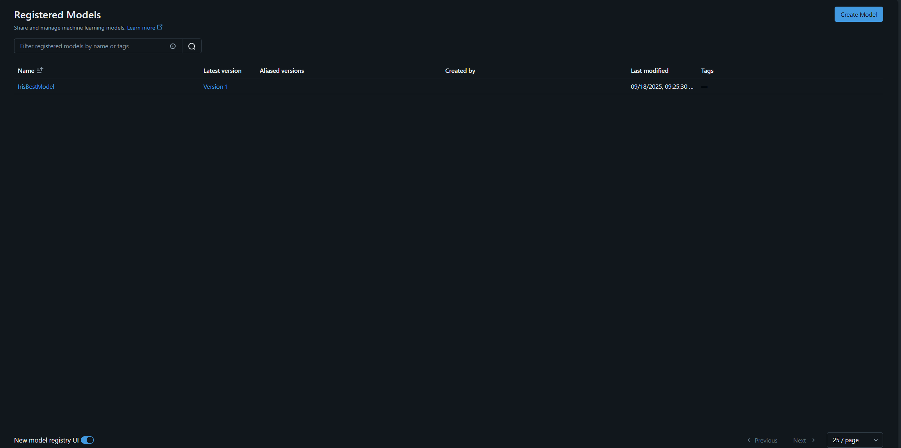

# MLOps Assignment — README

**Project:** mlops-assignment-1

---

## Part 5 — Documentation & GitHub Submission

This README provides a step-by-step report so a grader or teammate can reproduce the experiments, inspect MLflow logs, and load the registered model.

---

## 1. Problem statement & dataset description

**Problem statement**
Classify Iris flower species (Setosa, Versicolor, Virginica) using supervised learning. The aim is to compare multiple models, record experiments with MLflow, pick the best model by an evaluation metric, register it in the MLflow Model Registry, and provide reproducible instructions.

**Dataset**

* **Name:** Iris (scikit-learn builtin)
* **Samples:** 150
* **Classes:** 3 (balanced)
* **Features:** sepal length, sepal width, petal length, petal width

---

## 2. Model selection & comparison

**Models trained**

* Logistic Regression (`sklearn.linear_model.LogisticRegression`)
* Decision Tree (`sklearn.tree.DecisionTreeClassifier`)
* Support Vector Machine (`sklearn.svm.SVC`)

**Evaluation metrics used**

* Accuracy
* Precision (weighted)
* Recall (weighted)
* F1-score (weighted) — primary metric for selecting the best model

**Protocol**

* Single train/test split: 80% train, 20% test, `random_state=42`, `stratify=y`.
* Each model is trained on the same split to ensure a fair comparison.
* Metrics calculated on the test set and logged to MLflow for each run.
* Best model selected based on **highest weighted F1-score**.

---

## 3. MLflow logging & artifacts

For each model run we log the following to MLflow:

* **Parameters**: model hyperparameters via `model.get_params()`
* **Metrics**: accuracy, precision, recall, f1 (all weighted)
* **Artifacts**:

  * `results/{model}_cm.png` — confusion matrix image
  * `results/{model}_metrics.png` — bar chart comparing metrics
  * `models/{model}.pkl` — serialized model (joblib)

**How to view**

* Start MLflow UI and open `http://127.0.0.1:5000`.
* Open the experiment (e.g., `MLOPS_IRIS`) to see all runs.
* Click any run to see parameters, metrics and artifacts attached to that run.

---

## 4. Model registration & what to expect

* The best model is registered under the name: **IrisBestModel** using `mlflow.sklearn.log_model(..., registered_model_name="IrisBestModel")`.
* Registration creates a **version** (v1, v2, ...). MLflow assigns version numbers automatically.
* The Model Registry entry contains the model name, version list, stage , and a link to the source run. Metrics themselves live inside the source run; the registry stores pointers & artifacts.


---

## 5. MLflow logging screenshots 




## Confusion Matrices
- Logistic Regression  
  

- Decision Tree  
  

- SVM  
  


---

## 6. Model registration screenshots 



## 7. Instructions to run the code (step-by-step)

> These instructions assume Windows PowerShell; Unix users can use equivalent commands.

### 1) Clone repo

```bash
git clone https://github.com/<your-username>/mlops-assignment-1.git
cd mlops-assignment-1
```

### 2) Create and activate virtual environment (recommended)

**Windows (PowerShell)**

```powershell
python -m venv .venv
.\.venv\Scripts\Activate.ps1
pip install --upgrade pip
```

**Unix / macOS**

```bash
python3 -m venv .venv
source .venv/bin/activate
pip install --upgrade pip
```

### 3) Install dependencies


Run:

```bash
pip install -r requirements.txt
```

### 4) Start MLflow UI / Tracking Server

Run in a separate terminal so the UI stays open:

```bash
python -m mlflow ui 
```

Open: `http://127.0.0.1:5000`

### 5) Run the training & logging script


```bash
python mLflow.py
```

This script will:

* Train Logistic Regression, Decision Tree, and SVM
* Log parameters, metrics and artifacts to MLflow under the experiment `MLOPS_IRIS`
* Save local artifacts in `models/` and `results/`
* Register the best model as `IrisBestModel` in the Model Registry

### 6) Inspect runs and model registry

* In MLflow UI: `Experiments` → `MLOPS_IRIS` to view runs.
* In UI: `Models` → `IrisBestModel` to view registered versions and source run links.

### 7) Load a registered model for inference

```python
import mlflow.sklearn
model = mlflow.sklearn.load_model("models:/IrisBestModel/1")  # load by version
preds = model.predict([[5.1, 3.5, 1.4, 0.2]])
print(preds)
```

---

## 8. Submission checklist (GitHub)

Make sure your repository contains the following before submission:

```
README.md
iris_mlflow.py (or src/iris_mlflow.py)
requirements.txt
models/                # saved .pkl models (optional)
results/               # confusion matrices & metric plots
docs/                  # screenshots
```

Push to GitHub:

```bash
git add README.md iris_mlflow.py requirements.txt models/ results/ docs/
git commit -m "Add MLflow pipeline, README, and artifacts"
git push origin main
```

---

## 9. Notes for the grader

* If MLflow UI does not show runs, ensure you started the MLflow server (`python -m mlflow ui`) before running the script.
* If the model is not registered, check the script output — registration occurs only if `best_model` is set and `mlflow.sklearn.log_model(..., registered_model_name='IrisBestModel')` executes.
* To display key metrics on the registry page, set model-version tags via the `MlflowClient`.

---

## 10. Contact

If anything in reproduction fails, share the terminal output or screenshots and I will help debug.

---

*End of README*
